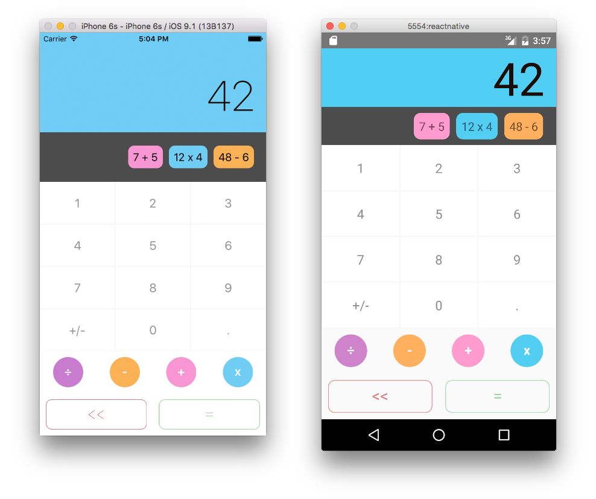

# Mobile, desktop and website Apps with the same code

- `npm run build` to build the project (at least the first time)
- `npm run serve-web` to preview in the browser at http://localhost:8000/index.web.html or http://localhost:8000/webpack-dev-server/index.web.html with webpack-dev-server and hot reload enabled
